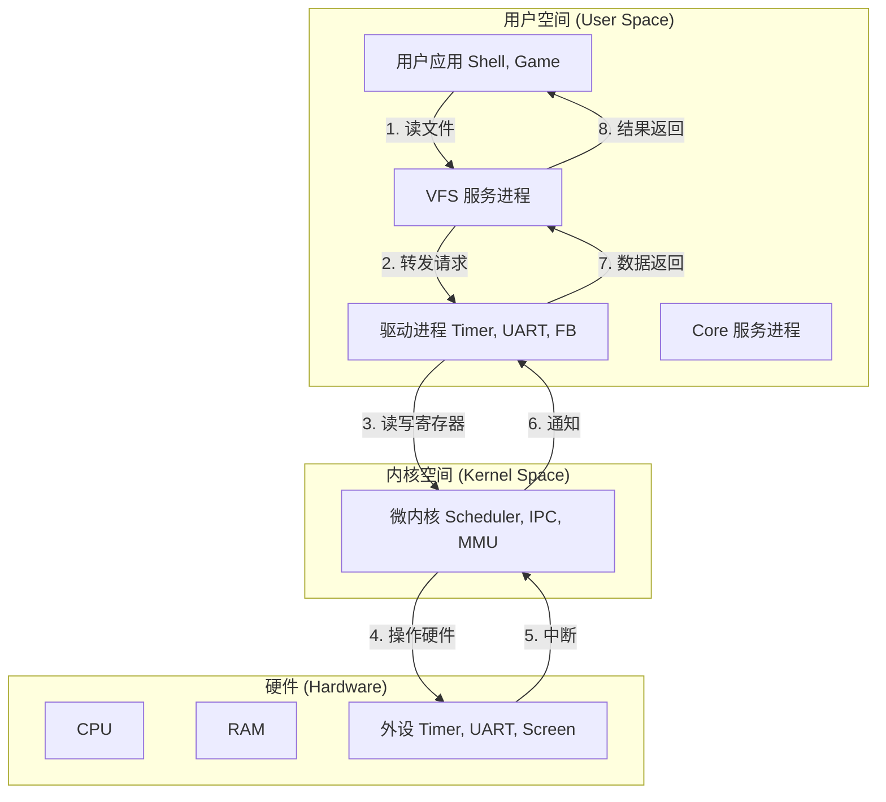

# 第二章：EwokOS - 小内核，大梦想

在上一章中，我们了解了操作系统的演化历史和宏内核与微内核的哲学之争。现在，让我们从理论走向实践，深入 EwokOS 的内部，看看一个现代微内核操作系统是如何构建的。

## 2.1 架构总览：美味的三明治

当你第一次打开 EwokOS 的源代码时，可能会被各种目录和文件搞得眼花缭乱。但实际上，EwokOS 的架构设计非常清晰——如果把它比作一个三明治，每一层都有明确的职责和边界。

如果把 EwokOS 比作一个三明治，它的结构是这样的：

### 1. 底层面包：微内核 (The Kernel)
这是三明治的最底层，也是最硬的一层。它直接铺在盘子（硬件）上。
*   **位置**：`kernel/kernel`
*   **职责**：
    *   **调度**：决定谁能咬一口 CPU。支持抢占式调度和多核调度。
    *   **IPC**：负责传递层与层之间的酱料（消息）。提供同步和异步两种通信方式。
    *   **内存管理**：划分地盘，防止大家打架。实现虚拟内存、页表管理和 COW（写时复制）。
    *   **中断处理**：响应硬件中断，分发给相应的驱动进程。
*   **特点**：代码量极少，只有几千行。它不认识文件，不认识键盘，甚至不知道怎么在屏幕上画画。它只负责最基本的生存需求。

**核心目录结构**：
```
kernel/kernel/
├── include/           # 头文件
│   └── kernel/
│       ├── proc.h     # 进程管理相关定义
│       ├── ipc.h      # IPC 相关接口
│       ├── mm/        # 内存管理
│       └── ...
├── src/               # 源代码
│   ├── kernel.c       # 内核入口和初始化
│   ├── sched.c        # 调度器实现
│   ├── ipc.c          # IPC 实现
│   ├── mm/            # 内存管理实现
│   │   ├── mmu.c      # MMU 配置
│   │   ├── kmalloc.c  # 内核内存分配
│   │   └── shm.c      # 共享内存
│   └── ...
```

### 2. 中间夹心：核心服务 (Core Services)
这层是三明治的精华，提供了操作系统的基础口感。
*   **位置**：`system/basic/`
*   **成员**：
    *   **Core** (`system/basic/init/core.c`)：内核的大管家，负责进程的注册、生杀大权。它是用户空间启动的第一个进程（PID=1），类似 Linux 的 init。
    *   **VFS (Virtual File System)** (`system/basic/sbin/vfsd`)：虚拟文件系统。它是一个服务进程，负责管理所有的文件和设备。在 EwokOS 里，**一切皆文件**，而 VFS 就是这些文件的总管理员。
    *   **procserv**：管理 `/proc` 文件系统，提供进程信息查询。
    *   **devd**：设备管理守护进程，负责设备的注册和路由。

**系统目录结构**：
```
system/
├── basic/             # 基础系统组件
│   ├── init/          # Core 进程 (PID=1)
│   ├── libc/          # C 标准库实现
│   ├── libs/          # 系统库
│   │   ├── vfs/       # VFS 客户端库
│   │   ├── ipc/       # IPC 封装库
│   │   └── ...
│   ├── sbin/          # 系统服务
│   │   ├── vfsd/      # VFS 守护进程
│   │   ├── devd/      # 设备管理
│   │   └── ...
│   ├── drivers/       # 驱动程序
│   └── bin/           # 用户工具
├── gui/               # 图形界面系统
└── xwin/              # X Window 系统
```

### 3. 上层配菜：驱动与应用 (Drivers & Apps)
这层是最丰富多彩的，想加什么就加什么。
*   **位置**：`system/basic/drivers`, `system/basic/bin`
*   **成员**：
    *   **驱动程序**：
        *   `timerd`：时钟驱动，提供系统时间和定时器服务
        *   `uartd`：串口驱动，处理串口通信
        *   `fbd`：Framebuffer 显卡驱动，管理图形显示
        *   `sdd`：SD 卡驱动，读写存储卡
        *   `usbd`：USB 驱动，支持 USB 设备
        *   注意！它们是**普通进程**，和计算器、记事本没有本质区别，只是它们有权访问特定的硬件。
    *   **文件系统驱动**：
        *   `fsd/ext2d`：EXT2 文件系统驱动
        *   `fsd/fatfsd`：FAT 文件系统驱动
    *   **应用程序**：
        *   `shell`：命令行界面
        *   `ls`, `ps`, `cat`：常用 Unix 工具
        *   GUI 应用（如果编译了图形界面）

## 2.2 核心组件图解

让我们画一张图来看看它们是怎么互动的：

```
┌─────────────────────────────────────────────────────────────┐
│                   用户空间 (User Space)                      │
│                                                             │
│  ┌──────────┐  ┌──────────┐  ┌──────────┐  ┌──────────┐     │
│  │   App    │  │  Driver  │  │   VFS    │  │   Core   │     │
│  │  (应用)  │  │  (驱动)  │  │  (文件)  │  │  (核心)  │        │
│  └──────────┘  └──────────┘  └──────────┘  └──────────┘     │
│       ↓             ↑              ↑             ↑          │
└───────┼─────────────┼──────────────┼─────────────┼──────────┘
        │             │              │             │
        │  IPC 调用   │              │             │
        └─────────────┴──────────────┘             │
                      │                            │
┌─────────────────────┼────────────────────────────┼──────────┐
│                     ↓                            ↓           │
│              内核空间 (Kernel Space)                         │
│  ┌──────────────────────────────────────────────────────┐  │
│  │   微内核 (Scheduler, IPC, MMU, Interrupt Handler)   │  │
│  └──────────────────────────────────────────────────────┘  │
│                             ↓                                │
└─────────────────────────────┼────────────────────────────────┘
                              ↓
┌─────────────────────────────┼────────────────────────────────┐
│                   硬件 (Hardware)                             │
│  ┌────────┐  ┌────────┐  ┌──────────────────────┐            │
│  │  CPU   │  │  RAM   │  │  外设 (Timer, UART)  │             │
│  └────────┘  └────────┘  └──────────────────────┘            │
└───────────────────────────────────────────────────────────────┘
```

数据流向：
1. App 通过 IPC 请求 VFS 读取文件
2. VFS 将请求转发给对应的驱动进程
3. 驱动通过系统调用请求内核操作硬件
4. 内核操作硬件寄存器
5. 硬件产生中断，通知内核
6. 内核唤醒驱动进程
7. 驱动返回数据给 VFS
8. VFS 返回结果给 App


## 2.3 为什么这样设计？

你可能会问，为什么要把驱动放在用户空间？让它们直接在内核里跑不是更快吗？

这就好比：**为什么不让修水管的工人住在你家里？**

*   **安全性**：如果修水管的工人（驱动）住在你家（内核），他万一发疯了（Bug），可能会把你的房子拆了（系统崩溃）。如果他只是上门服务（用户进程），他发疯了，你把他赶出去（Kill 进程）就行了，房子还在。
*   **灵活性**：你想换个修水管的？直接换人就行，不用搬家。在 EwokOS 里，你可以在系统运行时加载、卸载驱动，就像打开关闭 App 一样简单。

当然，代价就是——**沟通成本**。每次修水管都要打电话预约、开门、关门（IPC 通信），确实比住在家里随叫随到要慢一点。但为了安全和灵活，这个代价是值得的。

### 真实世界的教训：Windows 蓝屏的故事

为什么微内核如此强调稳定性？让我们看一个真实的例子。

在 Windows XP 时代，微软允许驱动程序直接运行在内核态。这带来了极高的性能，但也带来了噩梦般的后果。据统计，**85% 的 Windows 蓝屏死机 (BSOD) 是由第三方驱动程序导致的**。一个显卡驱动的 bug，就能让整个系统瘫痪，用户的工作全部丢失。

2009 年，微软一次更新推送了一个有问题的 TCP/IP 驱动，导致全球数百万台电脑无法启动，这就是著名的"黑屏事件"。这次事故让微软痛定思痛，在 Windows 10 中引入了更严格的驱动签名机制和隔离措施。

相比之下，在微内核系统中，驱动运行在用户空间。如果 EwokOS 的 USB 驱动崩溃了，系统只需要简单地重启这个驱动进程，用户甚至可能都不会注意到。这就是**容错性 (Fault Tolerance)** 的魅力。

### 性能 vs 可靠性：永恒的权衡

你可能会想，既然性能有损失，为什么还要选择微内核？答案取决于应用场景：

*   **服务器和关键系统**：宁愿慢 10%，也不能容忍一次崩溃。例如，QNX 微内核被用于核电站控制系统、医疗设备和汽车电子（如特斯拉的仪表盘）。
*   **嵌入式和物联网**：设备数量庞大，远程维护困难。微内核的稳定性意味着更少的维护成本。
*   **个人电脑和游戏**：用户更关心性能和兼容性。宏内核（如 Linux、Windows）依然是主流。

EwokOS 的设计理念是：**在可接受的性能损失下，换取极高的稳定性和可维护性**。对于学习操作系统原理来说，这是一个完美的平衡点。

## 2.4 启动流程：从零到英雄

让我们看看 EwokOS 是如何从上电启动到运行 Shell 的：

1.  **硬件启动**：CPU 从固定地址开始执行（如 ARM 的 `0x8000`）
2.  **Bootloader**：如果在真实硬件上，先由 GPU 固件加载 `kernel7.img` 到内存
3.  **内核初始化** (`kernel/kernel/src/kernel.c`)：
    *   设置异常向量表
    *   初始化 MMU，启用虚拟内存
    *   初始化调度器
    *   初始化 IPC 机制
    *   加载第一个用户进程 `init`
4.  **Init 进程启动** (`system/basic/init/init.c`)：
    *   挂载根文件系统 `/`
    *   启动 Core 服务（进程管理器）
5.  **Core 进程** (`system/basic/init/core.c`)：
    *   启动 VFS 守护进程
    *   启动设备管理器 `devd`
    *   根据配置启动各种驱动（`timerd`, `uartd`, `sdd` 等）
6.  **VFS 和驱动就绪**：
    *   驱动向 VFS 注册设备节点（如 `/dev/timer`, `/dev/tty0`）
    *   文件系统驱动挂载分区
7.  **启动 Shell**：
    *   Core 启动登录程序 `login`
    *   用户登录后，启动 `shell`
    *   用户开始与系统交互

整个启动过程是一个**分层、渐进式**的过程。每一层都依赖下一层提供的服务，就像搭积木一样逐步构建起整个系统。

## 2.5 编译系统：Makefile 的艺术

EwokOS 使用传统的 `make` 构建系统，但组织得非常巧妙：

```bash
# 编译内核（以 Raspberry Pi 2 为例）
cd kernel/build/raspi2/pix
make                    # 生成 kernel7.img

# 编译系统和应用
cd system
make basic              # 只编译基础系统（无 GUI）
make gui                # 编译带 GUI 的系统
make                    # 编译完整系统（包括 X Window）

# 生成 SD 卡镜像
make sd                 # 生成可直接写入 SD 卡的完整镜像
```

编译产物：
*   `kernel7.img`：内核镜像
*   `system/build/root.ext2`：根文件系统镜像
*   `system/build/data.ext2`：用户数据分区

## 2.6 本章小结与展望

在这一章中，我们从宏观角度剖析了 EwokOS 的三层架构：

*   **微内核层**：极简主义的典范，只用几千行代码实现了调度、IPC、内存管理等核心功能
*   **核心服务层**：Core 和 VFS 作为系统的基石，为上层提供进程管理和文件系统服务
*   **驱动和应用层**：所有驱动都是普通进程，带来了前所未有的灵活性和稳定性

我们还通过 Windows 蓝屏的真实案例，理解了微内核设计的深层动机——**牺牲少量性能，换取极高的可靠性**。

但这里还有一个悬念：内核是如何"操控"这些进程的？当我们运行一个程序时，CPU 是如何在不同进程之间切换的？进程"睡眠"和"唤醒"的背后发生了什么？

**这就是下一章的核心内容**——进程与线程管理。我们将深入内核的调度器，看看它如何像一个超级指挥家，协调着系统中数十个、甚至上百个进程的"演奏"。你会看到：
*   每个进程的"身份证"——`proc_t` 结构体的完整解剖
*   CPU 如何在进程间"瞬移"——上下文切换的魔术
*   多核系统的挑战——如何让 4 个 CPU 核心高效协作而不互相干扰

准备好进入操作系统的"心脏"了吗？让我们继续前进。
