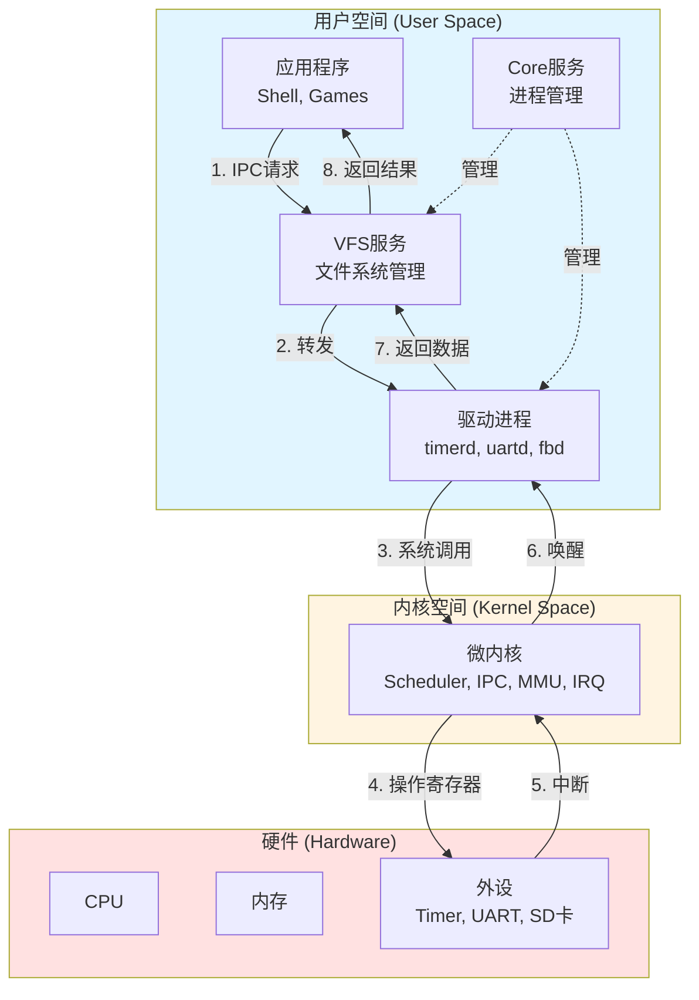
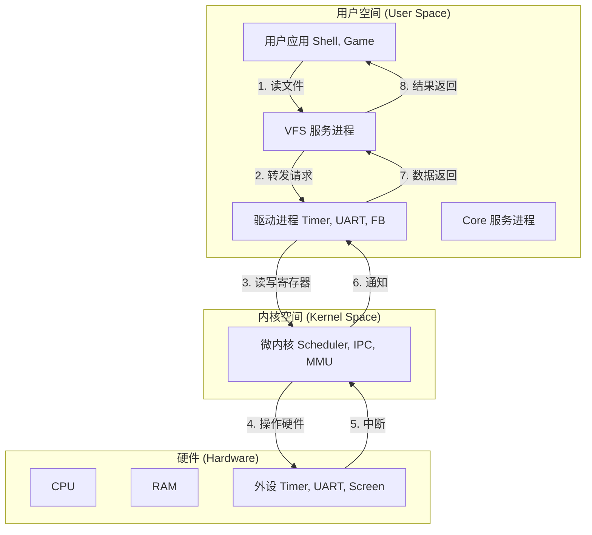

# 第二章：EwokOS - 小内核，大梦想

在上一章中，我们了解了操作系统的演化历史和宏内核与微内核的哲学之争。现在，让我们从理论走向实践，深入 EwokOS 的内部，看看一个现代微内核操作系统是如何构建的。

## 2.1 架构总览：美味的三明治

当你第一次打开 EwokOS 的源代码时，可能会被各种目录和文件搞得眼花缭乱。但实际上，EwokOS 的架构设计非常清晰——如果把它比作一个三明治，每一层都有明确的职责和边界。

如果把 EwokOS 比作一个三明治，它的结构是这样的：

### 1. 底层面包：微内核 (The Kernel)
这是三明治的最底层，也是最硬的一层。它直接铺在盘子（硬件）上。
*   **位置**：`kernel/kernel`
*   **职责**：
    *   **调度**：决定谁能咬一口 CPU。支持抢占式调度和多核调度。
    *   **IPC**：负责传递层与层之间的酱料（消息）。提供同步和异步两种通信方式。
    *   **内存管理**：划分地盘，防止大家打架。实现虚拟内存、页表管理和 COW（写时复制）。
    *   **中断处理**：响应硬件中断，分发给相应的驱动进程。
*   **特点**：代码量极少，只有几千行。它不认识文件，不认识键盘，甚至不知道怎么在屏幕上画画。它只负责最基本的生存需求。

**核心目录结构**：
```
kernel/kernel/
├── include/           # 头文件
│   └── kernel/
│       ├── proc.h     # 进程管理相关定义
│       ├── ipc.h      # IPC 相关接口
│       ├── mm/        # 内存管理
│       └── ...
├── src/               # 源代码
│   ├── kernel.c       # 内核入口和初始化
│   ├── sched.c        # 调度器实现
│   ├── ipc.c          # IPC 实现
│   ├── mm/            # 内存管理实现
│   │   ├── mmu.c      # MMU 配置
│   │   ├── kmalloc.c  # 内核内存分配
│   │   └── shm.c      # 共享内存
│   └── ...
```

### 2. 中间夹心：核心服务 (Core Services)
这层是三明治的精华，提供了操作系统的基础口感。
*   **位置**：`system/basic/`
*   **成员**：
    *   **Core** (`system/basic/init/core.c`)：内核的大管家，负责进程的注册、生杀大权。它是用户空间启动的第一个进程（PID=1），类似 Linux 的 init。
    *   **VFS (Virtual File System)** (`system/basic/sbin/vfsd`)：虚拟文件系统。它是一个服务进程，负责管理所有的文件和设备。在 EwokOS 里，**一切皆文件**，而 VFS 就是这些文件的总管理员。
    *   **procserv**：管理 `/proc` 文件系统，提供进程信息查询。
    *   **devd**：设备管理守护进程，负责设备的注册和路由。

**系统目录结构**：
```
system/
├── basic/             # 基础系统组件
│   ├── init/          # Core 进程 (PID=1)
│   ├── libc/          # C 标准库实现
│   ├── libs/          # 系统库
│   │   ├── vfs/       # VFS 客户端库
│   │   ├── ipc/       # IPC 封装库
│   │   └── ...
│   ├── sbin/          # 系统服务
│   │   ├── vfsd/      # VFS 守护进程
│   │   ├── devd/      # 设备管理
│   │   └── ...
│   ├── drivers/       # 驱动程序
│   └── bin/           # 用户工具
├── gui/               # 图形界面系统
└── xwin/              # X Window 系统
```

### 3. 上层配菜：驱动与应用 (Drivers & Apps)
这层是最丰富多彩的，想加什么就加什么。
*   **位置**：`system/basic/drivers`, `system/basic/bin`
*   **成员**：
    *   **驱动程序**：
        *   `timerd`：时钟驱动，提供系统时间和定时器服务
        *   `uartd`：串口驱动，处理串口通信
        *   `fbd`：Framebuffer 显卡驱动，管理图形显示
        *   `sdd`：SD 卡驱动，读写存储卡
        *   `usbd`：USB 驱动，支持 USB 设备
        *   注意！它们是**普通进程**，和计算器、记事本没有本质区别，只是它们有权访问特定的硬件。
    *   **文件系统驱动**：
        *   `fsd/ext2d`：EXT2 文件系统驱动
        *   `fsd/fatfsd`：FAT 文件系统驱动
    *   **应用程序**：
        *   `shell`：命令行界面
        *   `ls`, `ps`, `cat`：常用 Unix 工具
        *   GUI 应用（如果编译了图形界面）

## 2.2 核心组件图解

让我们画一张图来看看它们是怎么互动的：



数据流向：
1. App 通过 IPC 请求 VFS 读取文件
2. VFS 将请求转发给对应的驱动进程
3. 驱动通过系统调用请求内核操作硬件
4. 内核操作硬件寄存器
5. 硬件产生中断，通知内核
6. 内核唤醒驱动进程
7. 驱动返回数据给 VFS
8. VFS 返回结果给 App


## 2.3 为什么这样设计？

你可能会问，为什么要把驱动放在用户空间？让它们直接在内核里跑不是更快吗？

这就好比：**为什么不让修水管的工人住在你家里？**

*   **安全性**：如果修水管的工人（驱动）住在你家（内核），他万一发疯了（Bug），可能会把你的房子拆了（系统崩溃）。如果他只是上门服务（用户进程），他发疯了，你把他赶出去（Kill 进程）就行了，房子还在。
*   **灵活性**：你想换个修水管的？直接换人就行，不用搬家。在 EwokOS 里，你可以在系统运行时加载、卸载驱动，就像打开关闭 App 一样简单。

当然，代价就是——**沟通成本**。每次修水管都要打电话预约、开门、关门（IPC 通信），确实比住在家里随叫随到要慢一点。但为了安全和灵活，这个代价是值得的。

### 真实世界的教训：Windows 蓝屏的故事

为什么微内核如此强调稳定性？让我们看一个真实的例子。

在 Windows XP 时代，微软允许驱动程序直接运行在内核态。这带来了极高的性能，但也带来了噩梦般的后果。据统计，**85% 的 Windows 蓝屏死机 (BSOD) 是由第三方驱动程序导致的**。一个显卡驱动的 bug，就能让整个系统瘫痪，用户的工作全部丢失。

2009 年，微软一次更新推送了一个有问题的 TCP/IP 驱动，导致全球数百万台电脑无法启动，这就是著名的"黑屏事件"。这次事故让微软痛定思痛，在 Windows 10 中引入了更严格的驱动签名机制和隔离措施。

相比之下，在微内核系统中，驱动运行在用户空间。如果 EwokOS 的 USB 驱动崩溃了，系统只需要简单地重启这个驱动进程，用户甚至可能都不会注意到。这就是**容错性 (Fault Tolerance)** 的魅力。

### 性能 vs 可靠性：永恒的权衡

你可能会想，既然性能有损失，为什么还要选择微内核？答案取决于应用场景：

*   **服务器和关键系统**：宁愿慢 10%，也不能容忍一次崩溃。例如，QNX 微内核被用于核电站控制系统、医疗设备和汽车电子（如特斯拉的仪表盘）。
*   **嵌入式和物联网**：设备数量庞大，远程维护困难。微内核的稳定性意味着更少的维护成本。
*   **个人电脑和游戏**：用户更关心性能和兼容性。宏内核（如 Linux、Windows）依然是主流。

EwokOS 的设计理念是：**在可接受的性能损失下，换取极高的稳定性和可维护性**。对于学习操作系统原理来说，这是一个完美的平衡点。

## 2.3.1 微内核的大梦想：IPC 带来的编程便利性

微内核最大的优势不仅是稳定性，更是**编程模型的简洁性**。让我们通过一个具体例子来对比 EwokOS 和 Linux 的驱动开发。

### 场景：编写一个简单的设备驱动

假设我们要写一个时钟驱动，提供"读取当前时间"的功能。

**在 Linux（宏内核）中**：

```c
// Linux 内核模块 (运行在内核空间)
#include <linux/module.h>
#include <linux/kernel.h>
#include <linux/fs.h>
#include <linux/cdev.h>

static dev_t dev_num;
static struct cdev *timer_cdev;

// 读操作 - 必须处理内核空间和用户空间的数据传递
static ssize_t timer_read(struct file *filp, char __user *buf, 
                          size_t count, loff_t *offset) {
    uint64_t time = get_system_time();
    
    // 必须使用 copy_to_user，不能直接访问用户空间指针
    if (copy_to_user(buf, &time, sizeof(time)))
        return -EFAULT;
        
    return sizeof(time);
}

static struct file_operations timer_fops = {
    .owner = THIS_MODULE,
    .read = timer_read,
};

// 初始化 - 复杂的注册流程
static int __init timer_init(void) {
    // 1. 分配设备号
    if (alloc_chrdev_region(&dev_num, 0, 1, "timer") < 0)
        return -1;
        
    // 2. 创建字符设备
    timer_cdev = cdev_alloc();
    cdev_init(timer_cdev, &timer_fops);
    
    // 3. 注册设备
    if (cdev_add(timer_cdev, dev_num, 1) < 0) {
        unregister_chrdev_region(dev_num, 1);
        return -1;
    }
    
    printk(KERN_INFO "Timer driver loaded\n");
    return 0;
}

static void __exit timer_exit(void) {
    cdev_del(timer_cdev);
    unregister_chrdev_region(dev_num, 1);
    printk(KERN_INFO "Timer driver unloaded\n");
}

module_init(timer_init);
module_exit(timer_exit);
MODULE_LICENSE("GPL");
```

**挑战**：
*   必须区分内核空间和用户空间，不能直接访问用户指针
*   需要理解 Linux 设备模型（字符设备、设备号等）
*   一个 bug 可能导致整个内核崩溃（"oops"或"panic"）
*   调试困难，需要 kgdb 或 printk
*   编译需要匹配内核版本，不能用标准 C 库

**在 EwokOS（微内核）中**：

```c
// EwokOS 驱动 (运行在用户空间)
#include <stdio.h>
#include <stdlib.h>
#include <unistd.h>
#include <ewoksys/vdevice.h>
#include <ewoksys/syscall.h>

// 设备控制函数 - 处理读写请求
static int timer_dcntl(int from_pid, int cmd, 
                       proto_t* in, proto_t* out, void* p) {  // p: 用户数据指针，此例中未使用
    if (cmd == CNTL_READ) {
        // 直接使用普通的函数调用
        uint64_t time = syscall1(SYS_GET_SYS_TIME, 0);
        
        // 简单的数据序列化，内核会自动传递
        proto_add_uint64(out, time);
        return 0;
    }
    return -1;
}

// 主函数 - 就像普通程序
int main(int argc, char** argv) {
    // 初始化设备结构
    vdevice_t dev;
    memset(&dev, 0, sizeof(vdevice_t));
    strcpy(dev.name, "timer");
    
    // 设置处理函数
    dev.dev_cntl = timer_dcntl;
    
    // 向 VFS 注册并进入事件循环
    // device_run 内部处理所有 IPC 通信
    device_run(&dev, "/dev/timer", FS_TYPE_CHAR, 0666);
    
    return 0;
}
```

**优势**：
*   ✅ 像普通程序一样编写，有 `main` 函数
*   ✅ 可以使用标准 C 库（`printf`, `malloc` 等）
*   ✅ 崩溃只影响这个驱动进程，不影响系统
*   ✅ 可以用普通的 GDB 调试，设置断点、单步执行
*   ✅ 编译简单，不依赖内核版本
*   ✅ IPC 机制自动处理数据传递，程序员无需关心

### IPC 的魔法：屏蔽复杂性

关键在于 `device_run()` 函数。它内部做了什么？

```c
// EwokOS 库函数 (简化版)
void device_run(vdevice_t* dev, const char* path, 
                int type, int access) {
    // 1. 连接到 VFS 服务
    int vfs_pid = get_service_pid("vfs");
    
    // 2. 通过 IPC 注册设备
    proto_t* req = proto_new(NULL, 0);
    proto_add_str(req, path);
    proto_add_int(req, type);
    ipc_call(vfs_pid, VFS_CMD_REGISTER_DEV, req);
    
    // 3. 进入事件循环
    while (1) {
        // 等待 VFS 发来的请求
        int cmd_id = ipc_fetch();
        if (cmd_id > 0) {
            proto_t* in = ipc_get_request();
            proto_t* out = proto_new(NULL, 0);
            
            // 调用用户提供的处理函数
            int ret = dev->dev_cntl(
                ipc_get_from_pid(), 
                proto_read_int(in), 
                in, out, NULL
            );
            
            // 返回结果给调用者
            ipc_end(cmd_id, ret, out);
        }
    }
}
```

**对比总结**：

| 特性 | Linux 宏内核 | EwokOS 微内核 |
|------|-------------|--------------|
| 代码行数 | ~60 行 | ~30 行 |
| 编程难度 | 高（内核编程） | 低（用户空间编程） |
| 调试难度 | 困难（kgdb） | 简单（GDB） |
| 崩溃影响 | 整个系统 | 单个进程 |
| 开发迭代 | 慢（重启系统） | 快（重启进程） |
| 可用库 | 仅内核 API | 标准 C 库 |
| IPC 开销 | 无 | 有（但很小） |

这就是微内核的"大梦想"：**让驱动开发像应用开发一样简单**。虽然 IPC 带来了一点性能开销，但换来的是：
*   更短的开发时间
*   更少的 bug
*   更容易维护
*   更高的系统稳定性

对于学习操作系统来说，这种简洁性让你可以专注于**理解原理**，而不是纠缠于复杂的内核 API。


## 2.4 启动流程：从零到英雄

让我们看看 EwokOS 是如何从上电启动到运行 Shell 的。整个过程就像建造一座大楼，从地基开始，层层叠加，最终呈现完整的系统。

```mermaid
flowchart TD
    Start([上电]) --> Boot[硬件启动<br/>CPU从0x8000开始执行]
    Boot --> Bootloader{在真实硬件？}
    Bootloader -->|是| GPU[GPU固件加载<br/>kernel7.img到内存]
    Bootloader -->|QEMU| KernelInit
    GPU --> KernelInit
    
    KernelInit[内核初始化<br/>kernel/kernel/src/kernel.c]
    KernelInit --> Step1[1. 设置异常向量表]
    Step1 --> Step2[2. 初始化MMU<br/>启用虚拟内存]
    Step2 --> Step3[3. 初始化调度器]
    Step3 --> Step4[4. 初始化IPC机制]
    Step4 --> Step5[5. 加载init进程<br/>PID=0]
    
    Step5 --> InitProc[Init进程<br/>system/basic/init/init.c]
    InitProc --> Mount[挂载根文件系统 /]
    Mount --> CoreStart[启动Core服务<br/>PID=1]
    
    CoreStart --> Core[Core进程<br/>system/basic/init/core.c]
    Core --> VFSStart[启动VFS守护进程]
    VFSStart --> DevdStart[启动设备管理器 devd]
    DevdStart --> DriversStart[启动驱动进程<br/>timerd, uartd, sdd, fbd等]
    
    DriversStart --> Register[驱动注册]
    Register --> Reg1[驱动向VFS注册设备节点<br/>/dev/timer, /dev/tty0等]
    Reg1 --> Reg2[文件系统驱动挂载分区<br/>ext2d, fatfsd]
    
    Reg2 --> Login[Core启动login程序]
    Login --> Shell[用户登录后启动shell]
    Shell --> Ready([系统就绪<br/>等待用户命令])
    
    style Start fill:#90EE90
    style KernelInit fill:#FFB6C1
    style Core fill:#87CEEB
    style Ready fill:#90EE90
```



### 详细说明

**第一阶段：硬件启动 (0-100ms)**
*   **CPU 上电**：ARM CPU 从固定地址（如 `0x8000`）开始执行
*   **Bootloader**：在真实硬件（树莓派）上，GPU 固件会先运行，加载 `kernel7.img` 到内存
*   **代码位置**：`kernel/build/raspi2/pix/boot.S` - 汇编启动代码

**第二阶段：内核初始化 (100-200ms)**
*   **异常向量表**：设置中断、系统调用等处理入口
*   **MMU 初始化**：配置页表，启用虚拟内存映射
*   **调度器初始化**：创建空闲进程，准备进程调度
*   **IPC 初始化**：准备进程间通信机制
*   **代码位置**：`kernel/kernel/src/kernel.c::kernel_main()`

**第三阶段：用户空间启动 (200-500ms)**
*   **Init 进程**：第一个用户进程（PID=0），负责挂载根文件系统
*   **Core 服务**：系统核心服务（PID=1），类似 Linux 的 systemd
*   **VFS 启动**：虚拟文件系统守护进程，提供统一文件接口
*   **代码位置**：`system/basic/init/init.c`, `system/basic/init/core.c`

**第四阶段：驱动加载 (500ms-1s)**
*   **时钟驱动** (`timerd`)：提供系统时间和定时器服务
*   **串口驱动** (`uartd`)：处理串口输入输出，显示启动日志
*   **SD 卡驱动** (`sdd`)：访问存储设备
*   **Framebuffer 驱动** (`fbd`)：如果有显示器，初始化图形输出
*   **代码位置**：`system/basic/drivers/`

**第五阶段：文件系统挂载 (1-1.5s)**
*   **EXT2 驱动** (`ext2d`)：挂载根分区和数据分区
*   **设备节点创建**：`/dev/timer`, `/dev/tty0`, `/dev/mmcblk0` 等
*   **进程信息文件系统**：`/proc/` 目录，提供进程信息查询

**第六阶段：用户界面 (1.5-2s)**
*   **Login 程序**：显示登录提示符
*   **Shell 启动**：用户登录后，启动命令行 Shell
*   **系统就绪**：用户可以输入命令，系统进入正常运行状态

整个启动过程是一个**分层、渐进式**的过程。每一层都依赖下一层提供的服务，就像搭积木一样逐步构建起整个系统。如果某个环节失败（如驱动崩溃），只会影响该服务，不会导致整个系统无法启动——这就是微内核的优势。

## 2.5 编译系统：Makefile 的艺术

EwokOS 使用传统的 `make` 构建系统，但组织得非常巧妙：

```bash
# 编译内核（以 Raspberry Pi 2 为例）
cd kernel/build/raspi2/pix
make                    # 生成 kernel7.img

# 编译系统和应用
cd system
make basic              # 只编译基础系统（无 GUI）
make gui                # 编译带 GUI 的系统
make                    # 编译完整系统（包括 X Window）

# 生成 SD 卡镜像
make sd                 # 生成可直接写入 SD 卡的完整镜像
```

编译产物：
*   `kernel7.img`：内核镜像
*   `system/build/root.ext2`：根文件系统镜像
*   `system/build/data.ext2`：用户数据分区

## 2.6 本章小结与展望

在这一章中，我们从宏观角度剖析了 EwokOS 的三层架构：

*   **微内核层**：极简主义的典范，只用几千行代码实现了调度、IPC、内存管理等核心功能
*   **核心服务层**：Core 和 VFS 作为系统的基石，为上层提供进程管理和文件系统服务
*   **驱动和应用层**：所有驱动都是普通进程，带来了前所未有的灵活性和稳定性

我们还通过 Windows 蓝屏的真实案例，理解了微内核设计的深层动机——**牺牲少量性能，换取极高的可靠性**。

但这里还有一个悬念：内核是如何"操控"这些进程的？当我们运行一个程序时，CPU 是如何在不同进程之间切换的？进程"睡眠"和"唤醒"的背后发生了什么？

**这就是下一章的核心内容**——进程与线程管理。我们将深入内核的调度器，看看它如何像一个超级指挥家，协调着系统中数十个、甚至上百个进程的"演奏"。你会看到：
*   每个进程的"身份证"——`proc_t` 结构体的完整解剖
*   CPU 如何在进程间"瞬移"——上下文切换的魔术
*   多核系统的挑战——如何让 4 个 CPU 核心高效协作而不互相干扰

准备好进入操作系统的"心脏"了吗？让我们继续前进。
